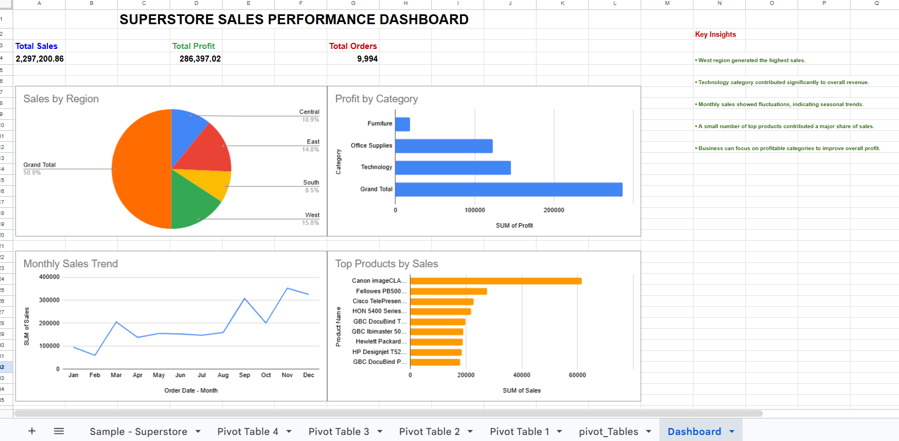

# Superstore Sales Dashboard

## Project Objective

The objective of this project was to analyze sales performance using the Superstore dataset and create an interactive dashboard for business decision-making.

## Tools Used

* Microsoft Excel
* Google Sheets
* Pivot Tables
* Pivot Charts

## KPIs

* Total Sales: ₹ 22,97,200.86
* Total Profit: ₹ 2,86,397.02
* Total Orders: 9,994

## Dashboard Features

* Sales by Region
* Profit by Category
* Monthly Sales Trend
* Top Products by Sales

## Key Insights

* West region generated the highest sales.
* Technology category contributed significantly to revenue.
* Monthly sales showed seasonal trends.
* Top products generated a large share of sales.

## Conclusion

This dashboard helps analyze sales performance and supports data-driven business decision-making.

